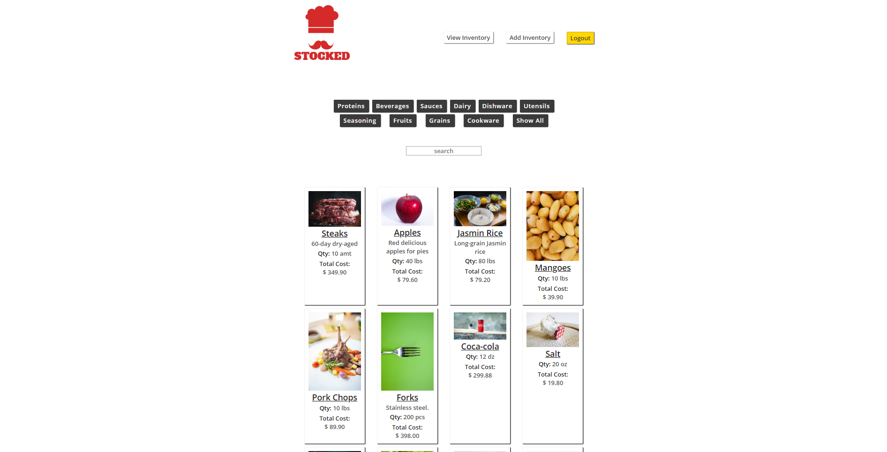

# STOCKED

A quick and easy supply tracking app that lets users add, edit, delete inventory items

<!-- links and login info -->

## Login

Username: Pip123
Password: Password123!

## Getting Started

This project was bootstrapped with Create React App.

### npm start

Runs the app in the development mode.
Open http://localhost:3000 to view it in the browser.

The page will reload if you make edits.
You will also see any lint errors in the console.

### npm test

Launches the test runner in the interactive watch mode.
See the section about running tests for more information.

## Motivation

This app was created to allow users to track their own unique inventory quickly and simply.

## Challenges

Since all the inventory is user-specific, it meant that there needed to be routes that were only accessible by the user who is logged in. It was also important that, upon logging in, the user would not be able to access other user's items simply by altering the url. This challenge required using React's Context provider to make API fetch calls to the server that obtained only the logged in user's inventory and no other user's. To achieve this user-specific API fetch call, it was also necessary to make use of the data found in props, more specifically, to make use of the params in order to reach the user id.

## Screenshots

  
Login:

  

  
Registration:

  

  
Inventory:

  

  
Add Item Form:

  

  
Edit Item Form:

  

## Technologies Used

React, Node.js, Express, JavaScript and PostgreSQL.
